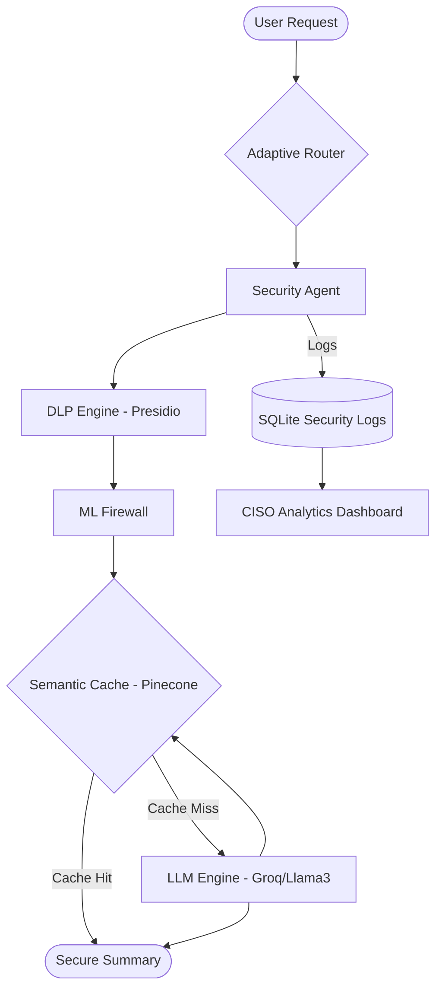

# 🛡️ The Identity Project: Secure Email Summarizer

**Secure LLM Gateway with Defensive Guardrails**

The Identity Project is a security-first gateway designed to bridge the gap between powerful LLMs (like Llama 3 via Groq/OpenAI) and corporate data privacy. It intercepts email data, scrubs sensitive information (PII), detects malicious prompt injections, and optimizes performance via semantic caching.

---

## 🚀 Key Features

### 1. 🛡️ DLP (Data Loss Prevention) Engine
Powered by **Microsoft Presidio**, the gateway automatically identifies and redacts:
- **PII**: Names, Phone Numbers, Email Addresses, SSNs.
- **Financials**: Credit Card Numbers.
- **Technical**: IP Addresses, Locations.

### 2. 🚦 ML Firewall & Adaptive Router
A multi-layered defense system that:
- Classifies incoming requests for risk levels.
- Switches between "Strict" and "Balanced" security modes based on detected intent.
- Prevents direct execution of instructions found within email bodies.

### 3. ⚡ Semantic Cache
Uses **Pinecone Vector Database** to:
- Store and retrieve previously summarized content.
- Dramatically reduce API costs and latency.
- Ensure that only authorized summarized versions are served.

### 4. 📊 CISO Analytics Dashboard
A real-time monitoring interface for security officers to track:
- Redaction counts and blocked malicious attempts.
- System health and LLM usage metrics.
- Security-to-Utility ratio.

---

## 🏗️ System Architecture



---

## 🛠️ Tech Stack

- **Backend**: FastAPI (Python)
- **AI/LLM**: Groq (Llama-3.3-70b-versatile) / OpenAI Compatible API
- **Privacy**: Microsoft Presidio (Analyzer & Anonymizer)
- **Vector DB**: Pinecone
- **Infrastructure**: Uvicorn, Dotenv, Pydantic
- **Frontend**: HTML5, CSS3, Vanilla JS

---

## 🏁 Getting Started

### Prerequisites
- Python 3.10+
- Groq API Key (or OpenAI Compatible API)
- Pinecone API Key

### Installation

1. **Clone the Repository**
   ```bash
   git clone https://github.com/yuktac1011/-LLM-Security-Gateway-with-Defensive-Guardrails.git
   cd -LLM-Security-Gateway-with-Defensive-Guardrails
   ```

2. **Setup Virtual Environment**
   ```bash
   cd backend
   python -m venv venv
   source venv/bin/activate  # On Windows: venv\Scripts\activate
   ```

3. **Install Dependencies**
   ```bash
   pip install -r requirements.txt
   ```

4. **Environment Configuration**
   Create a `.env` file in the `backend/` directory:
   ```env
   LLM_API_KEY=your_groq_api_key
   LLM_BASE_URL=https://api.groq.com/openai/v1
   MODEL_NAME=llama-3.3-70b-versatile
   PINECONE_API_KEY=your_pinecone_api_key
   PINECONE_INDEX_NAME=identity
   ```

5. **Run the Application**
   ```bash
   uvicorn main:app --reload
   ```

---

## 📖 Usage Example

When an email contains:
> "Hi, this is John Doe. My SSN is 123-45-6789. Can you summarize this report?"

The Gateway redacts it before sending to the LLM:
> "Hi, this is [PERSON]. My SSN is [US_SSN]. Can you summarize this report?"

---

## 🔒 Security Principles
- **Defense in Depth**: Multiple layers (DLP, Firewall, Prompt Sanitization).
- **Least Privilege**: LLMs are treated as untrusted executors.
- **Privacy by Design**: Sensitive data never touches the LLM provider's servers.

---

## 📜 License
Distrubuted under the MIT License. See `LICENSE` for more information.
